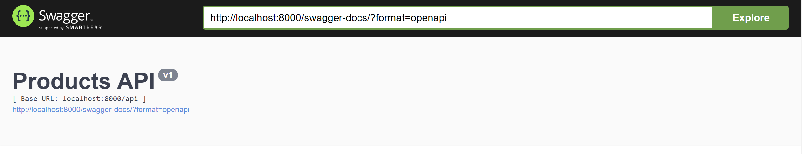
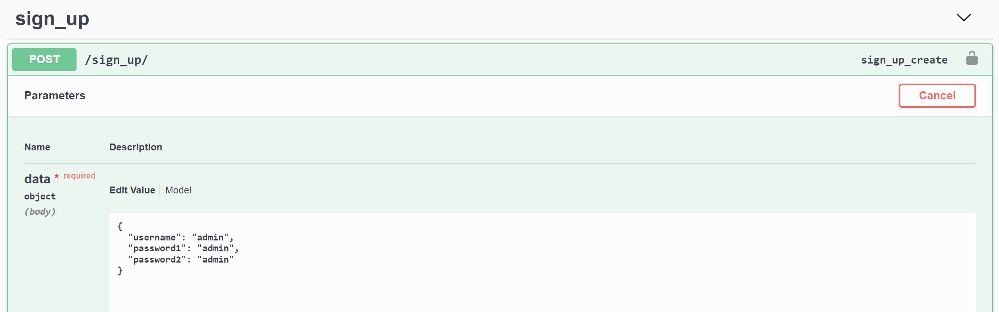
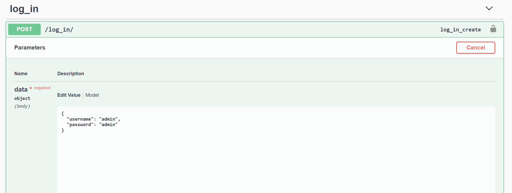
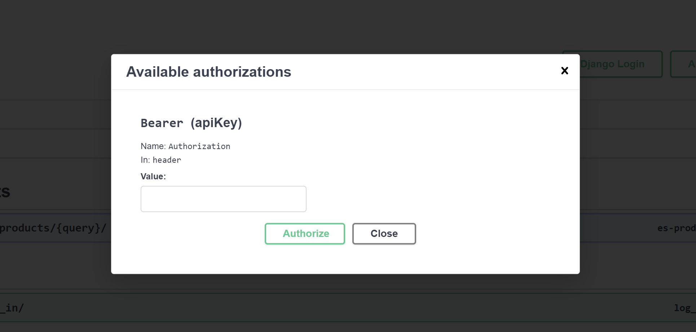

# **Products API**


### After cloning or downloading the repository `cd` to the project root and follow the steps below to run the API.
#
## **1. Build and run the images:**
```
$ docker-compose up --build
```

### You should now be able to open up [swagger-docs](http://localhost:8000/swagger-docs/)


## **2. Seed database with some initial data:**
```
$ docker-compose exec server python manage.py flush
$ docker-compose exec server python manage.py loaddata products.json
```

## **3. Seed elasticsearch with the data from database**
```
$ docker-compose exec server python manage.py elasticsearch
```

### Check if the records are in elasticsearch:
```
$ curl http://localhost:9200/product/_count?pretty

{
  "count" : 1000,
  "_shards" : {
    "total" : 1,
    "successful" : 1,
    "skipped" : 0,
    "failed" : 0
  }
}
```
## **4. Check if tests are passing**
```
$ docker-compose exec server pytest
```
## **5. Authenticate**
### **Sign up**


### **Log in**

### Copy the access_token value received in the response body.
### **Authorize**
### Write `Bearer` into the value field and right after paste the access_token value.


## **6. Play with the API**